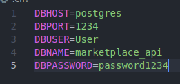

# API маркетплейса, рекомендации по развертыванию

В папке проекта лежит файл `.env` в нём вам нужно заполнить поля **DBPORT**, **DBUSER**, **DBPASSWORD**, ниже представлен пример:



После заполнения файла `.env`, проект готов к развертыванию, у вас уже должны быть установлены [Docker](https://www.docker.com/) и [Docker compose](https://docs.docker.com/compose/install/).

Откройте терминал и перейдите в папку проекта:

```bash
$ cd /marketplace-api
```

Выполните команду:

```bash
$ docker-compose up -d
```

Эта команда соберет два контейнера с приложением и базой данных к нему.

После выполнения всех действий и успешного запуска контейнеров, протестируйте работу приложения либо открыв страницу с документацией `/api/v1/docs`, либо импортировать [postman коллекцию](<FastApi collection.postman_collection.json>) в программу [Postman](https://www.postman.com/) и сделать описанные там запросы к API.
